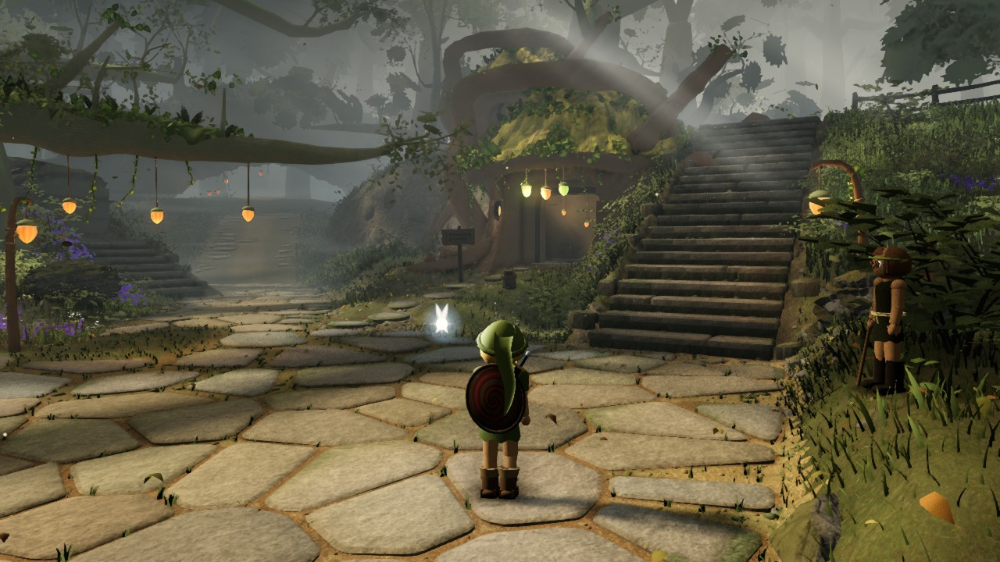
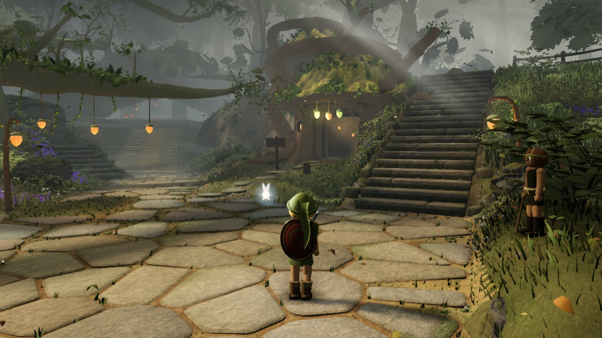
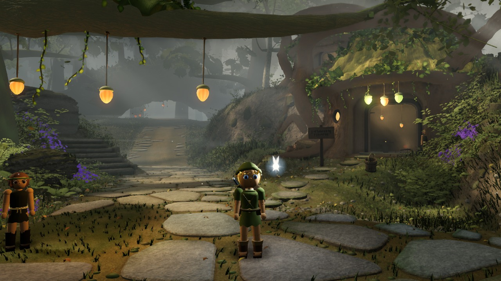
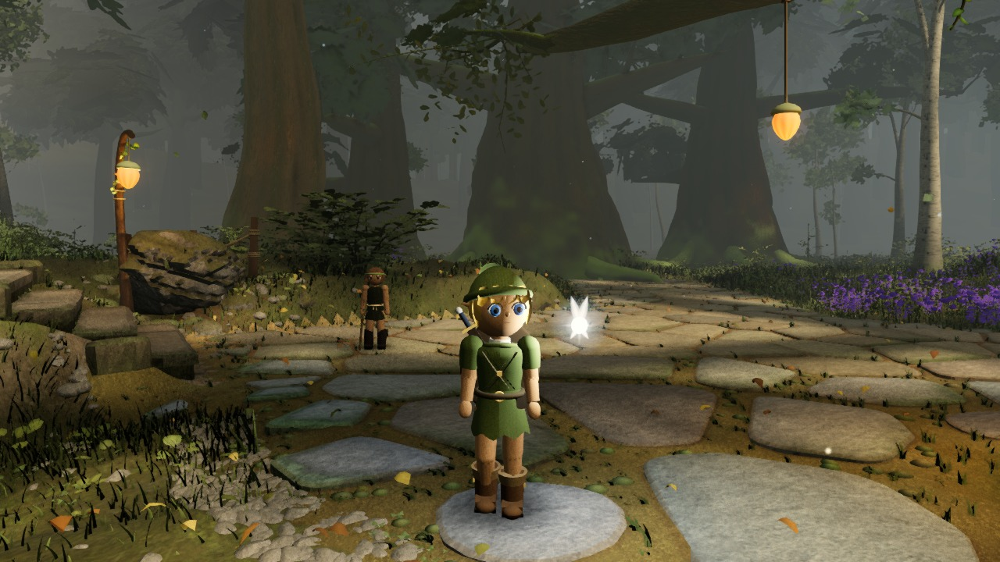
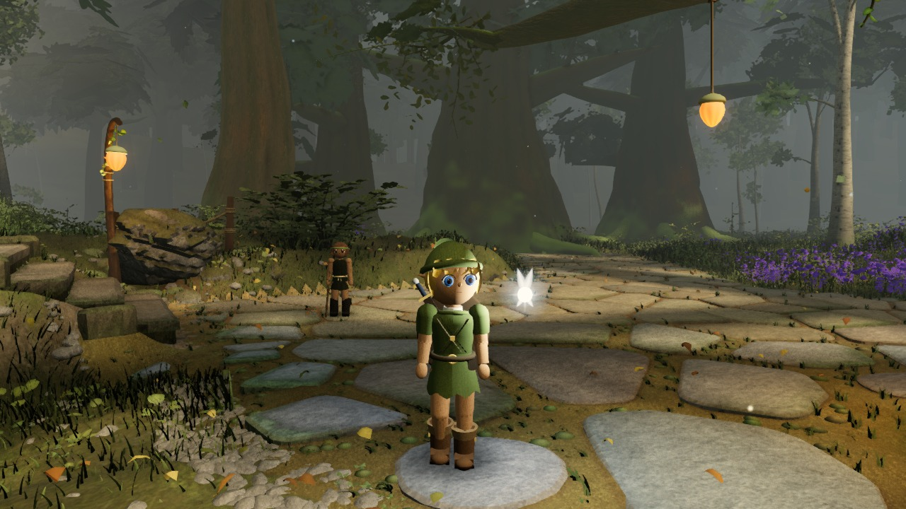
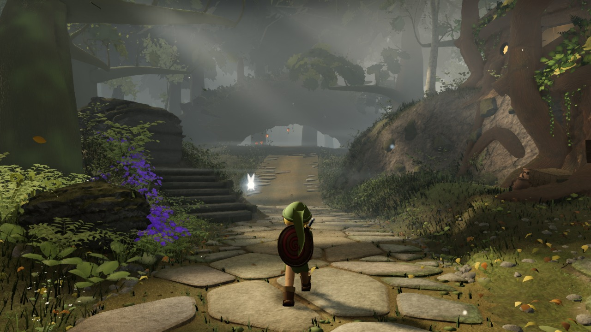
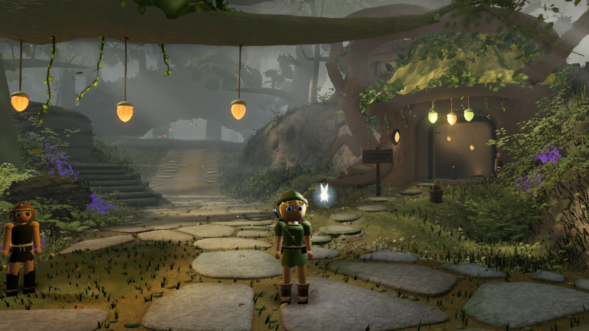
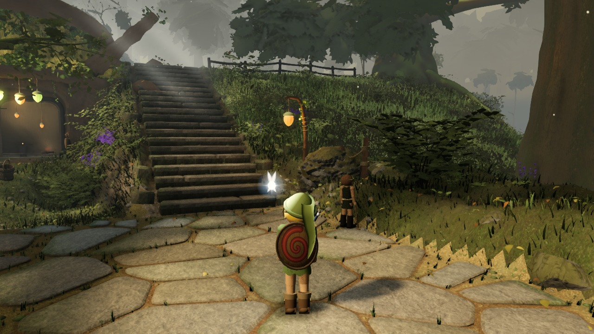
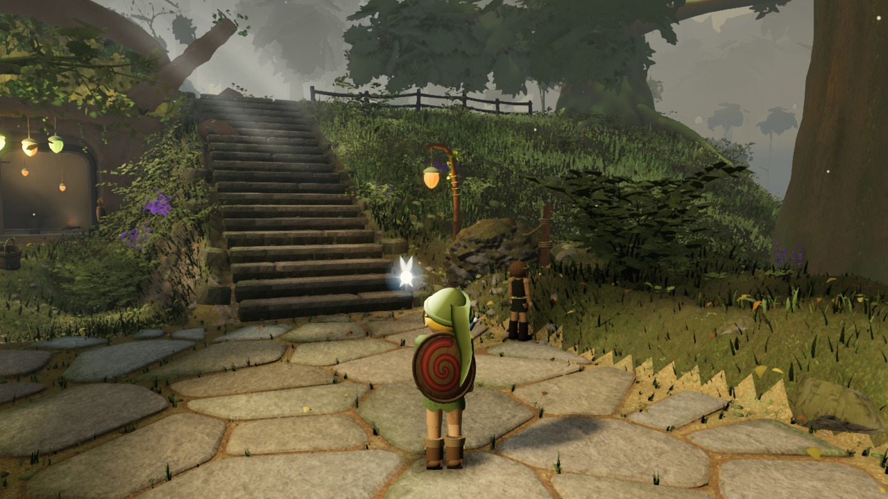

# Environment lighting comparison

Actual game renders from [f11517e](https://github.com/Leonxlnx/zeldaremake/commit/f11517e424cf333468c325885fe121245b54f756), captured 2026-09-12T08:45:15.200Z.

Both columns use this same built source, saved camera, scene time (12.5 s), geometry and fog. The baseline is a set of historical light/post controls, not a render of a separate historical build. Candidate controls are listed in environment.json. This supplemental study does not score or replace the locked gauntlet.

Baseline controls attributed to source: 23ea37a7d9ffaf6462362b1d15b1198707c89408.

Baseline: Production adoption of reviewed23ea candidate: cool fill, clear air, sharp materials; no runtime overrides. Candidate: Near-shadow refinement: modest extra cool fill and gentler contrast/contact AO.

Raw audits and requested controls are retained. Requested overrides are checked against the actual light objects and composer settings used by the last render; this is not an independent GPU measurement of irradiance or color.

## A_stairs

| Baseline | Candidate |
| --- | --- |
|  |  |

## B_house

| Baseline | Candidate |
| --- | --- |
|  |  |

## C_lookback

| Baseline | Candidate |
| --- | --- |
|  |  |

## D_log

| Baseline | Candidate |
| --- | --- |
|  |  |

## E_ground

| Baseline | Candidate |
| --- | --- |
|  |  |

## F_canopy

| Baseline | Candidate |
| --- | --- |
|  |  |
