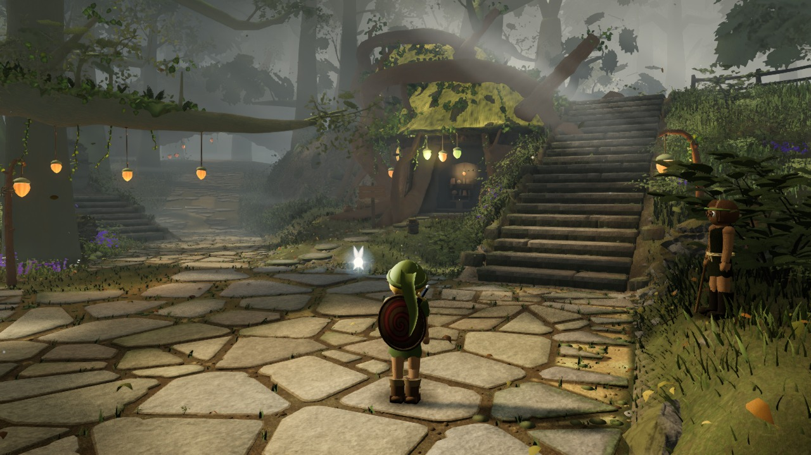
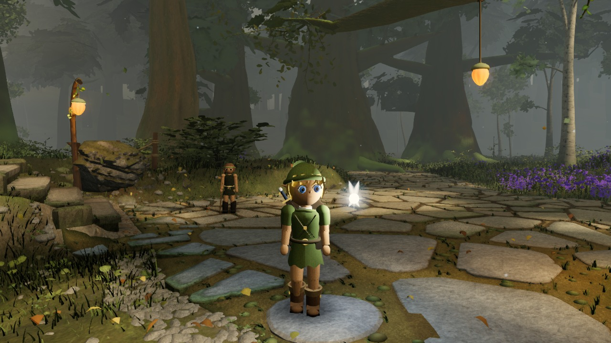
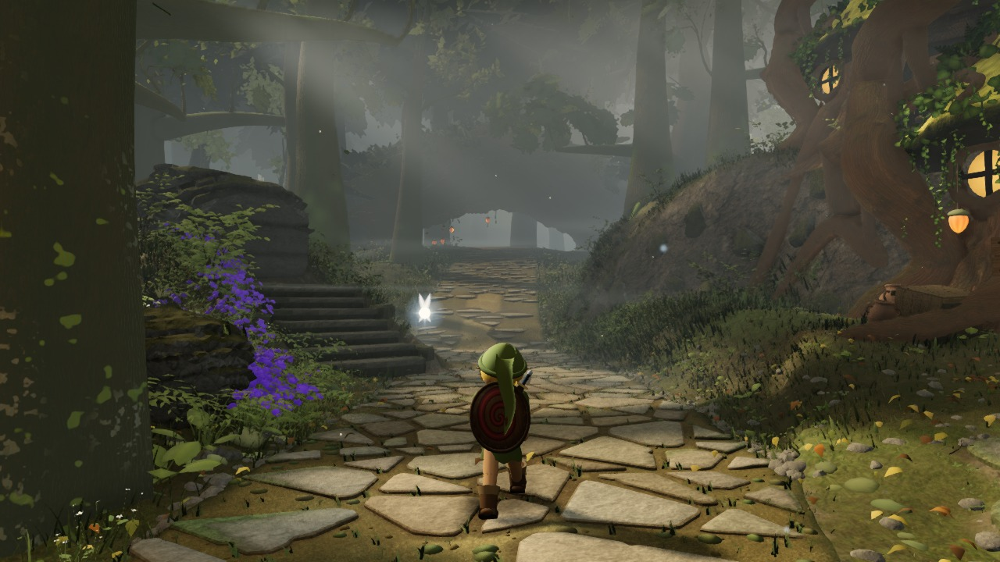
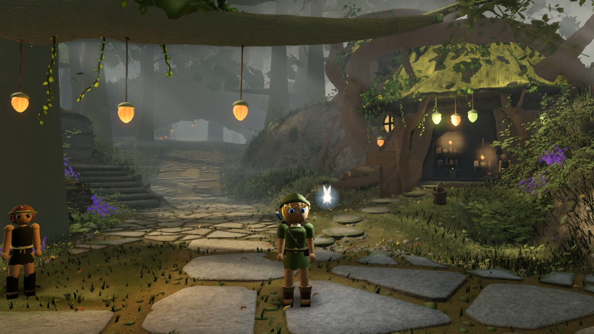
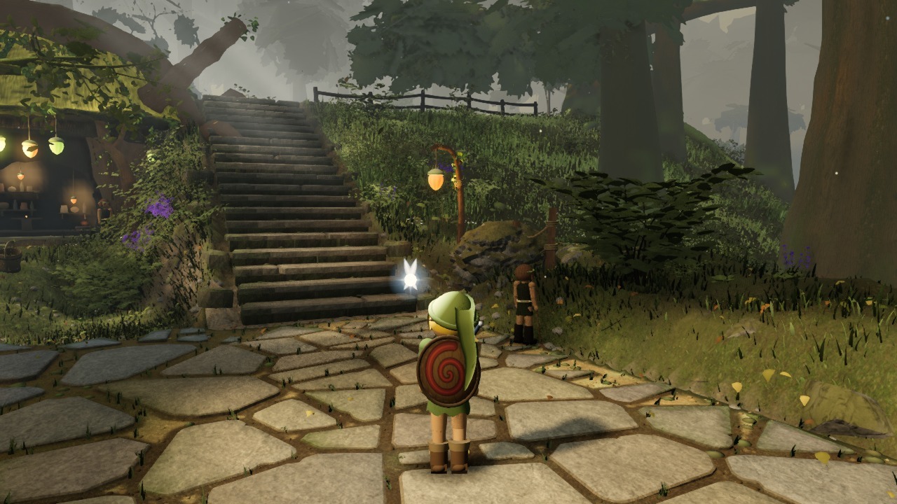

# Environment lighting comparison

Actual game renders from [ccc7e7f](https://github.com/Leonxlnx/zeldaremake/commit/ccc7e7f5eff6aa5da1e268ac1bb00bf565f19378), captured 2026-09-12T14:08:03.817Z.

Both columns use this same built source, saved camera, scene time (12.5 s), geometry and fog. The baseline is a set of historical light/post controls, not a render of a separate historical build. Candidate controls are listed in environment.json. This supplemental study does not score or replace the locked gauntlet.

Baseline controls attributed to source: d7ddc01bc74151a0f93fa19f7a6e9b37c99fa09f.

Baseline: Current world with the existing six shaft columns; new top-flight mask disabled. Candidate: Same world with the real top-flight opening admitted by the shadow-tested volumetric mask.

Raw audits and requested controls are retained. Requested overrides are checked against the actual light objects and composer settings used by the last render; this is not an independent GPU measurement of irradiance or color.

## A_stairs

| Baseline | Candidate |
| --- | --- |
|  |  |

## B_house

| Baseline | Candidate |
| --- | --- |
|  |  |

## C_lookback

| Baseline | Candidate |
| --- | --- |
|  |  |

## D_log

| Baseline | Candidate |
| --- | --- |
|  |  |

## E_ground

| Baseline | Candidate |
| --- | --- |
|  |  |

## F_canopy

| Baseline | Candidate |
| --- | --- |
|  |  |
