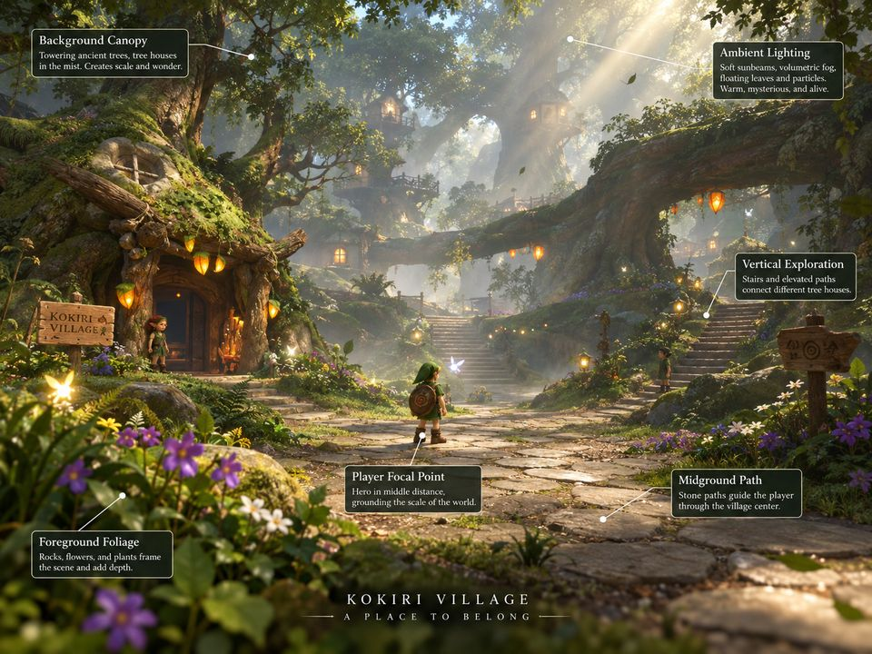
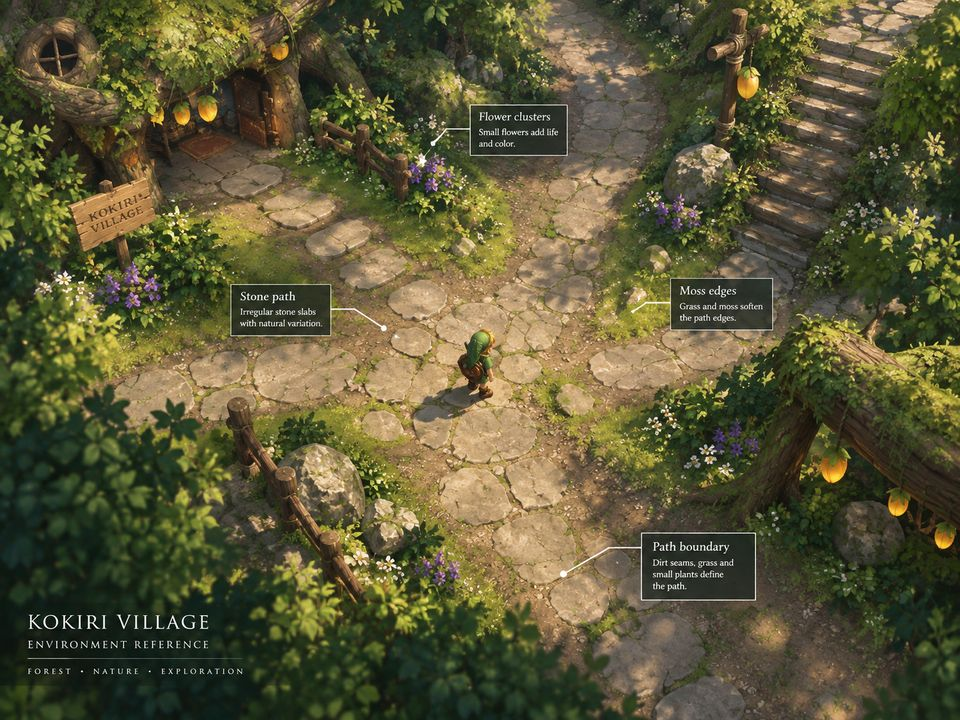
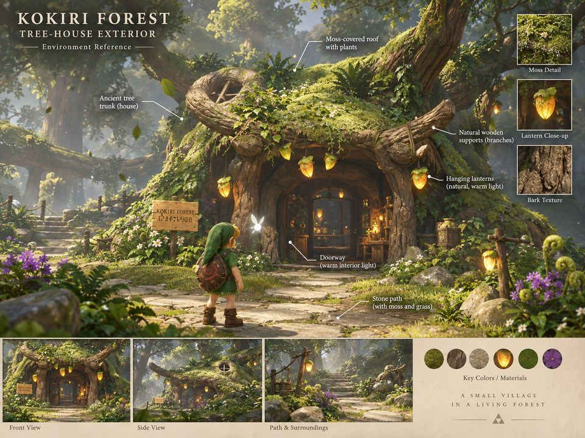
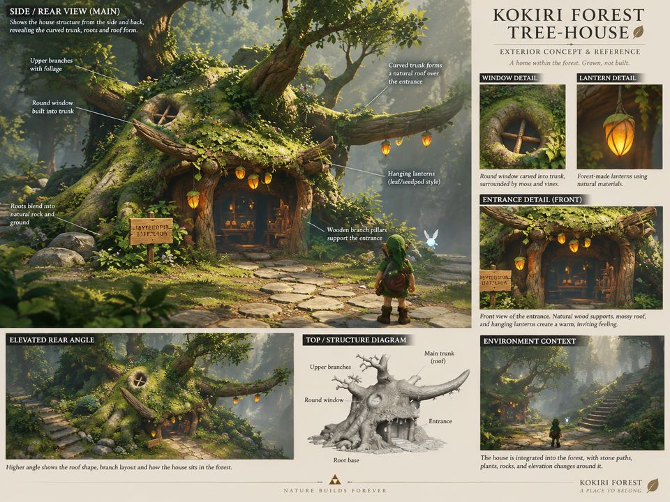
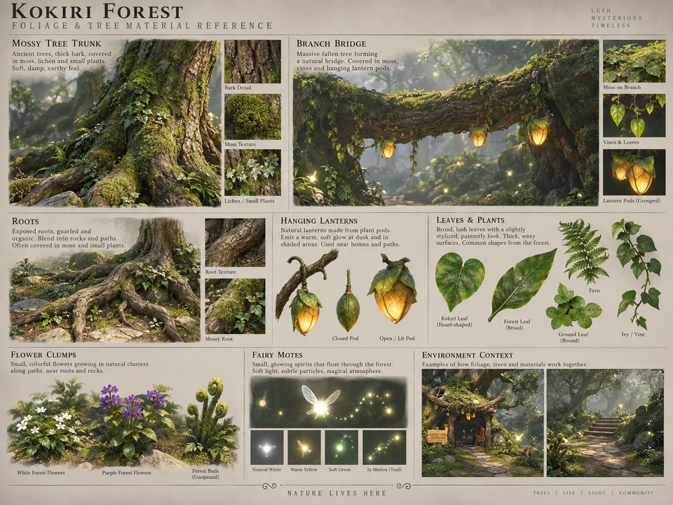
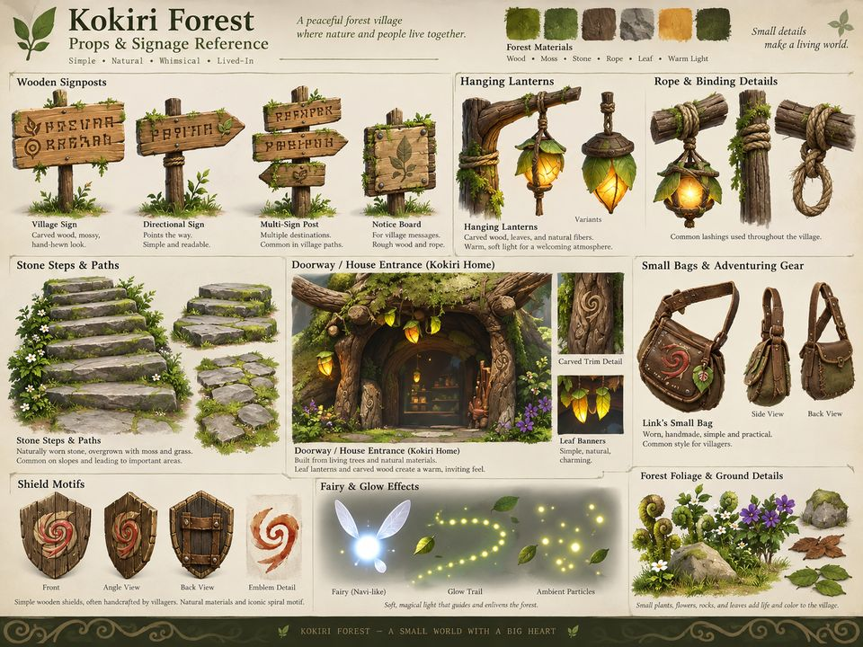
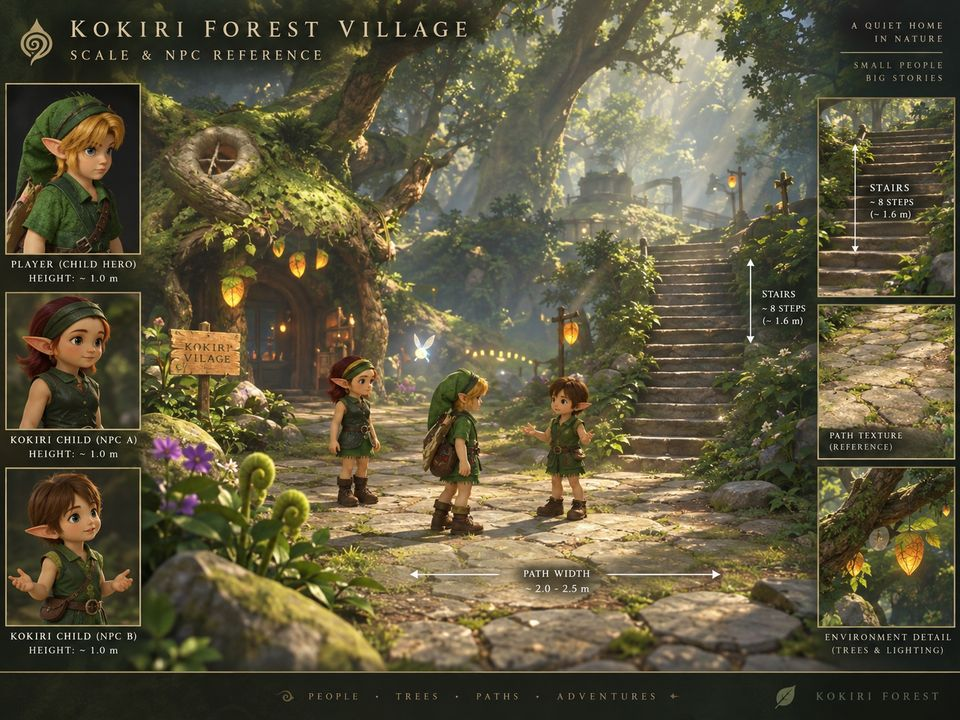
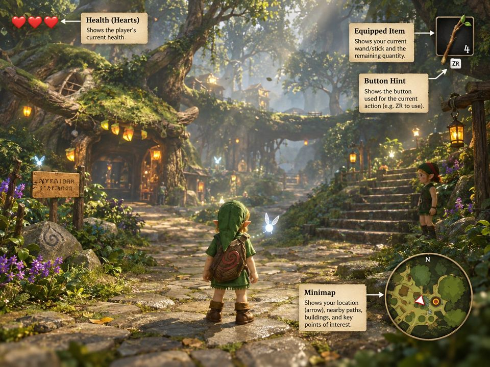
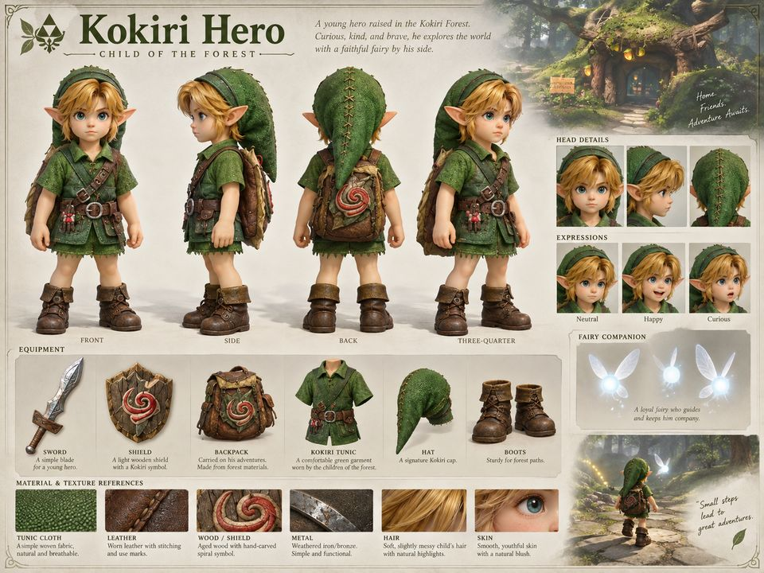
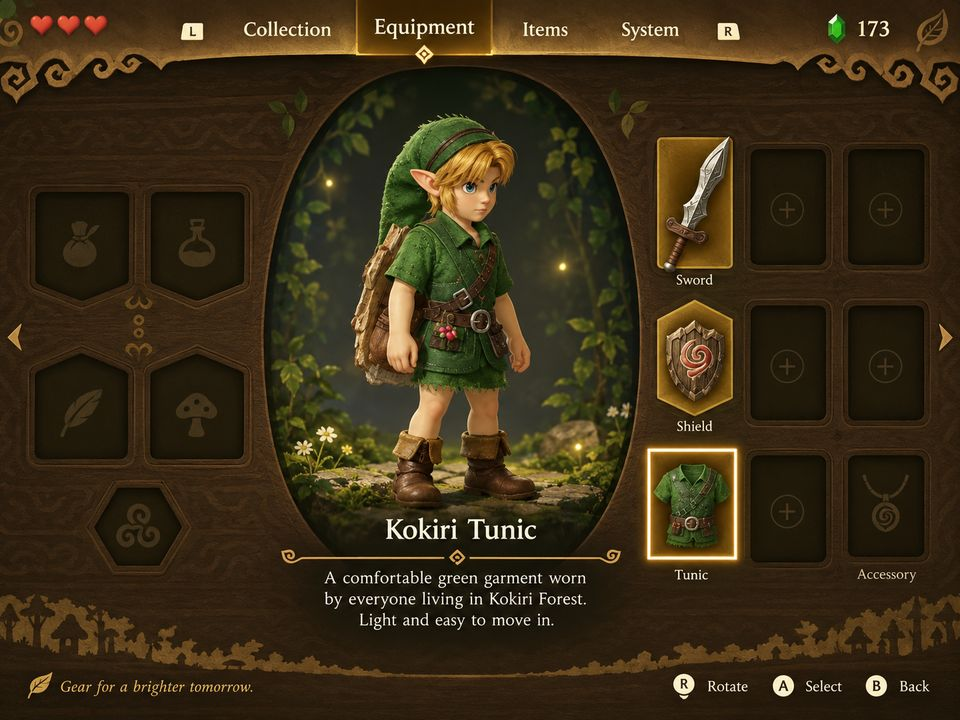

# Owner concept reference previews

All ten owner-supplied concepts are available below as **compressed previews**, resized to 960 pixels wide and saved as JPEG at quality 80. These are visual targets, not screenshots of completed game work.

**The exact original PNGs are retained locally; original upload is pending.** The connector stalled on the large original payloads, so these explicitly labeled previews provide a practical gallery now. [manifest.json](manifest.json) records each preview’s dimensions and SHA256 alongside its original PNG dimensions and SHA256.

Current priority: environment, lighting, shadows and detail. Character work is paused. Images are comparison-only and must not be used as game scenery, textures or backdrops.

## Village lighting — preview

## Paths and overhead shadows — preview

## Tree house front — preview

## Tree house structure — preview

## Foliage bark and bridge — preview

## Props signs and lanterns — preview

## Village scale — preview

## Gameplay composition — preview

## Character model reference — preview

## Equipment reference — preview

